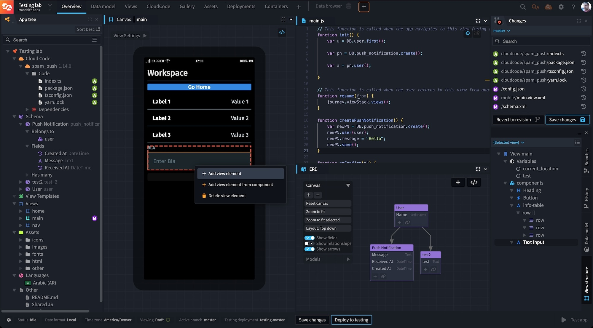
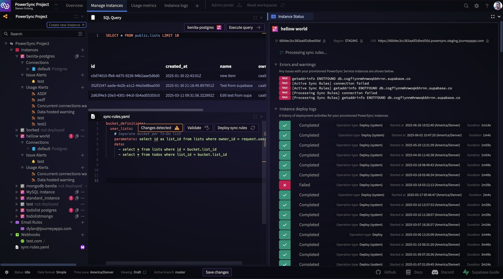
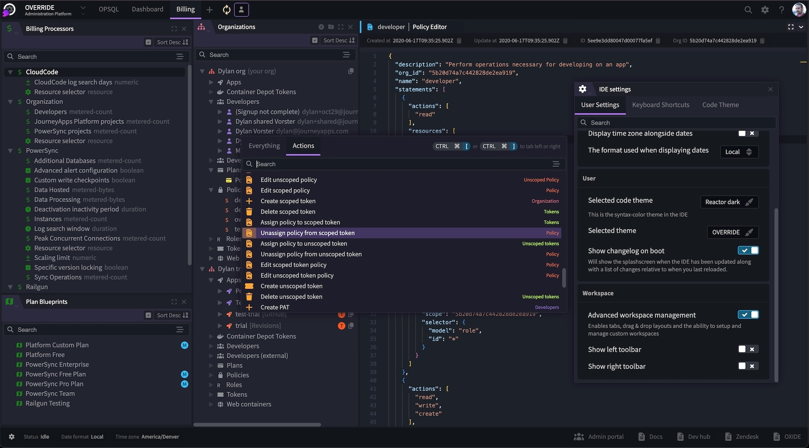

Many years back when we started working on the successor to the JourneyApps editor (now called OXIDE), we set
a goal for ourselves of building a great IDE framework that could power the next generation of online development environments.

At the time, we were not yet open-sourcing many of our lower level libraries, but we still made sure to separate the underlying
framework from the final IDE. We did this not only because we wanted to use Reactor for other in-house software such as a tool
called Override (for internal platform administration which we may release in the future for enterprise customers), but because
we have always said __"build everything as if it were a product."__

Well today marks that day, and we have finally decided that it's time to release Reactor to the world! Reactor can do
some pretty cool things and allows engineers to build highly-capable software at incredible speed. We called the framework
'Reactor' because the more entities you describe to it (along with the relationship between entities), the more Reactor
will automatically do for you and the more powerful it becomes (entities react with each other). 
We won't dive into too much that Reactor can currently do as we will save that for a future post, 
but if you have used the JourneyApps platform or PowerSync, then Reactor has been at the heart of the developer experience.

The packages and demo folder are fully operational and represent the same code that powers the cloud versions of OXIDE and the PowerSync Dashboard.
While the demo is a bit crude at the moment, we will continue to flesh it out and provide more concrete solid examples that can showcase the best
that Reactor has to offer. Here are some screenshots of all the software built on-top of Reactor:

OXIDE:

PowerSync Dashboard:

Override:
