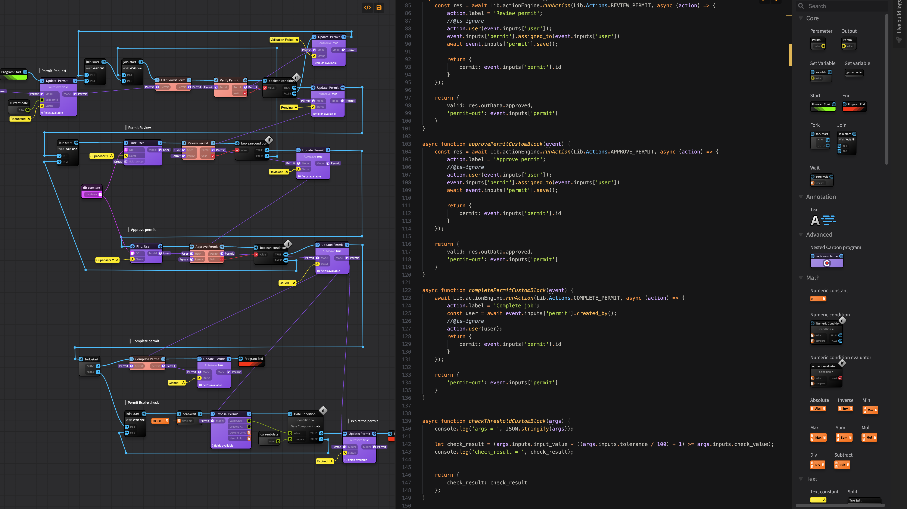
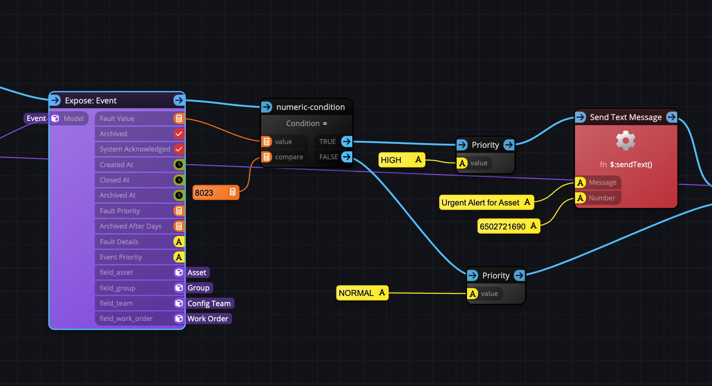

Today we are announcing that the Carbon library is now open source!

https://github.com/journeyapps-labs/carbon

Carbon is a visual programming language and execution engine that was developed in-house as a 
solution to an enormously complex customer requirement that almost made its way into production.

The goal was simple: 
* Allow apps deployed in the field, to be reprogrammed by technical users using visual means.
* Allow developers to create the default programs for such technical users as part of the application code.

While the goals were simple, creating such a feature and integrating it into the code-first platform was no easy task.
As with almost everything we create these days however, we decided to invest development time into a solid platform-agnostic
technology layer as the first step. Back then, we had hoped to license this technology in the future as a stand-alone product,
but today we are pleased that it is now open source!

Carbon is also a user-interface library __agnostic__ programming language and engine, meaning the way it is rendered is completely pluggable.
Since I am also the original author of react-diagrams (https://github.com/projectstorm/react-diagrams), we decided to do our rendering layer
using that library (represented as the `carbon-ui-storm` package within the repo). React-diagrams was always intended to be used
in a technology such as this, and it was also originally modeled over LabVIEW, UE blueprints and the Blender compositor which are stellar
examples of declarative visual programming technologies.

## So how can I use Carbon today?

At the moment, the best way to use Carbon, is to check out the `carbon-demo` folder which provides a demonstration
molecule (our terminology for a wired up collection of atoms, which we also call nodes). This demo also wires in to the default molecule the optional
atom builder package which allows custom atoms to be created using an XML parser (which we had originally developed as a way for developers
on the platform to define custom atoms within OXIDE). The debug demo shows how you can create a program from a molecule, compile it, debug it using the debugging canvas
and see its execution in realtime with the browser. 

Ultimately, you would want to serialize the molecules created in the browser, send and store them into a database (as JSON blobs), deserialize them on
a server and then compile and run the programs in threads. In the future we will most likely provide an out-of-the-box execution Docker image
for this exact purpose allowing Carbon programs to be used as a cloud execution programming system.

## How extensible is carbon?

Carbon is very extensible, as is demonstrated by the `elements` and `elements-ui` packages within the repo. These packages
represent the 'standard library' but also serve as a demonstration for how to create your own atom packs. At JourneyApps we extended
this in-house with a schema atom pack that used the platform `schema.xml` to create database model CRUD atoms. In the future
we may open source these libraries too!

## Will this feature ever be released to the JourneyApps Platform?
We are busy with some big plans for the [platform](https://journeyapps.com/platform/), and are currently hard at work on rolling out [V5](https://whatsnew.journeyapps.com/announcements/runtime-v5-is-here-and-so-is-our-new-discord). While not on the immediate roadmap, 
Carbon and its vertical integration within the platform were already near close to full completion at the time. We are considering this
as a possible future next step if there seems to be interest in the feature. If you are a platform customer and wish to see this technology
released, please reach out to us!

Some original screenshots of the technology inside the platform stack:

