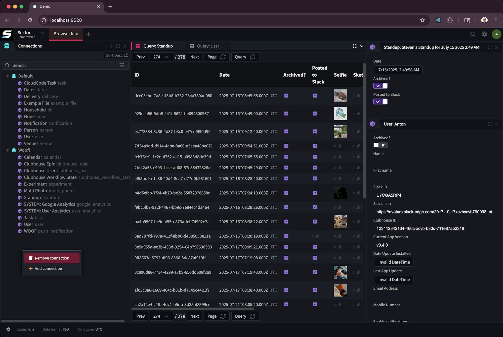

https://github.com/journeyapps-labs/sector

For almost a decade now, JourneyApps has been systematically improving and overhauling all of its core developer tools that contribute
to all aspects of the app development lifecycle. We first introduced OXIDE (built on-top of the [Reactor IDE framework](https://github.com/journeyapps-labs/reactor)) which represented 
a major overhaul of the app _editing_ experience. We updated the Admin Portal and improved the _administration_ parts of the platform making it easier
to switch between projects, set-up integrations, manage developers and work with roles. Recently we also announced version 5 of the Runtime
which represents a massive step forward to app _performance_ and _reliability_ due to the almost completely overhauled engine which now
adopts more declarative and deterministic engineering concepts.

Well today we are pleased to announce that we are making Sector open-source! Sector represents the future of the _data browsing_ experience
and like OXIDE, builds on-top of the Reactor framework super-charging the user experience. With tabs, workspaces, cmd palette, SPA, improved performance
and multiple deployments, developers can now work with deployment data in ways never seen before on the platform! Sector represents a large step forward for the 
product as it is one of the first pieces of end-user software that can be self-hosted on your own infrastructure. 

Over the next few weeks
we will be shipping docker images and providing tools such as Kubernetes configuration and docker compose files to help get developers
up and running quickly.

## Sector is modular technology

Sector's core capability has been envisioned from the beginning to be a Reactor module that will be embedded inside of OXIDE. While Sector will be deployed internally
as part of the JourneyApps Platform cloud toolset (and eventually replace the current backend UI as we get closer to feature parity), we will very shortly also be 
embedding the module inside of OXIDE with deep vertical integration making easier than ever to work with data without needing to switch software.

## This is just the beginning

Today marks the start of Sector's journey and there is still much work to do to get Sector shipped as part of the core product, but we are pleased
that we are able to already share our development in the open so early on. As we ship updates to Sector and make it more generally-available across
the product, we will continue to share updates and document our development journey here on the labs blog.

Sector is still very much a work-in-progress, and therefore we value early product feedback. If you start using Sector and have thoughts & suggestions, please
let us know over on the JourneyApps discord server and log some issues [directly on the sector repo](https://github.com/journeyapps-labs/sector)!